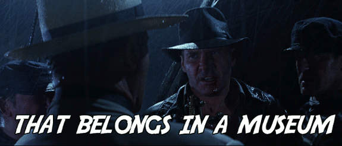

Title: First Drafts & Scraps of Paper - How collectors, copyright and the ephemeral nature of our hobby are contributing to the loss of our sub-cultural heritage.
Author: Andrew Eakett
Date: 2014-04-18

## Introduction
The RPG hobby is a young one. While wargames and bespoke examples existed earlier, it's probably safe to say that it was popularly born with the initial [release of D&D 40 years ago][dnd40birth]. Perhaps because of this, popular scholarship is just beginning. Works by [Peterson][patw] and [Ewalt][odam], as well as two upcoming documentaries on the history of Dungeons & Dragons are hopefully only the beginning of of an attempt to increase our understanding of the games that have been so important to so many. Unfortunately the primary progenitors of our hobby are recently deceased, and many of the people that were present at the dawn of RPGs are advancing in age. And while a great deal of popular published material is generally available, that availability is generally proportional to its initial popularity. Some very early and ephemeral material is quite hard to obtain. Libraries [hold a few issues][bgsucat] of the [Domesday Book][domesday] for example, and while [others are extant][domesdayfound], they are privately held and essentially inaccessible. To my knowledge, none are widely accessible. All of these factors lead to a situation where some of the more obscure historical elements of RPG history are disappearing or inaccessible to casual researchers.

## Perceived Value
Early on, this was just the hobby of some crazy guys in the mid-west. It's unlikely that anybody thought that their work would be important. Conversely, it's likely that all kinds of notes and material that the emergent scholarly community would love to see was disposed of. This attitude is still prevalent today. One particularly startling example is the near loss of a storage locker filled with some of Dave Arneson's notes, models, and various printed material. Thankfully, one man has taken it upon himself to start [PlaGMaDA][plagmada], an organization that seeks to "preserve, present, and interpret play generated cultural artifacts, namely manuscripts and drawings created to communicate a shared imaginative space." In my opinion, this is a wonderful start. After all, could a young James Jacobs have known that his homebrew campaign would later serve as a basis for a major campaign setting?

## Collectors
Collectors are both one of the great heroes, and greatest threats in the current situation. They are incessant researchers who can be well connected, and tend to be founts of obscure information. They have also had the foresight over the years to preserve things that would probably not still exist otherwise. On the other hand, they are private individuals who have no responsibility (or inclination in many cases) to widely share what they have. And why should they? They've often spent considerable time and effort putting their collections together. In the end though, this leads to a centralization of information which can make casual access for amateur researchers problematic. Another concern is how well these private collections are cared for. While I don't mean to question the motivations or qualifications of collectors, the fact is that their collections are almost certainly stored in an extra room in their house. No climate control, no professional monitoring, and no disaster plan. All to be expected, but still worrisome.[^gygaxfirefn] I would suggest that collectors who have completely, or relatively unique items make copies of them. I realize that this sort of practice is probably frowned upon by collectors since in a way it reduces the value.[^scanningandsellingfn]

## Copyright
The single greatest threat to our sub-cultural heritage is copyright. There is often a great reverence for the creators of the games we play, and it's fairly well known that nobody has ever gotten rich designing or publishing RPGs. Because of those facts, people with access to rare items are often overly (in my opinion) hesitant to share them. While I'm sympathetic to individual creators (and *small* companies), I believe that they have a moral responsibility to keep their work reasonably available, and to provide provisions for the release of material in the event of their deaths. Larger corporate IP owners I have less sympathy for. Either they should keep works reasonably available or they shouldn't complain about copies being made and distributed.
 -atk archive.org takedown of magazines

## The Role of Traditional Institutions

Donating rare and unique items to a museum or library would seem to be 
-lib/mus seem to be the answer
Indeed there are plenty of rare items in several different collections, though they tend to be part of larger, more general collections (ususally general popular culture collections). This could prove problematic in the long run as institutional collections policies may dictate deaccessioning materials.[^newspapershreddingfn]

-[Strong National Museum of Play][thestrong] seems to be the best bet currently
-certainly best bet for preservation, but casual scholarship is still hampered by centralization.

It might seem that depositing important documents into a library or museum would be the answer. While that certainly is a step in the right direction it is somewhat problematic. The first thing to consider is where such items might be deposited. A few institutions come immediately to mind. The Toronto Public Library's Merril Collection already has a fairly large collection of common RPG material. Bowling Green State University Library's Popular Culture Collection already holds three issues of the Domesday Book. However, it's likely safe to say that neither of these collections are comprehensive. Indeed, I'd be surprised to hear of any institution that holds a collection nearly as complete as some private collections.
-Indeed, this is where PlaGMaDA deposits their physical artifacts and is who Peterson has semi-permanently loaned the Dalluhn manuscript to.

## Conclusion
Here's how I see the current situation:  
 * Folk knowledge is literally dying.  
 * Unique items are being locked away in private collections.  
 * Rare items are practically inaccessible to casual researchers.  
 * Content creators could be doing more to provide access to their material.  
So what can we do? Save what you can. Donate your game documents to [PlaGMaDA][plagmada]. Ensure that your material will be properly disposed of after your death. If you have something unique that you didn't create make sure that it's physical condition is well maintained. Additionally, make digital copies. Scans are great, but readable high resolution photographs are good enough. Make multiple copies on stable media and store them in different places. Distribute them amongst like-minded individuals. Accept others' files and back them up like your own.  
Yes, I am essentially advocating piracy. I'm not suggesting the wholesale copying and distribution of readily available material (people have to eat). Think of it as an act of civil disobedience. The future cultural value of that seemingly insignificant thing that you have can't be known, and it's your job to make sure that somebody can find that significance in the future.

[^gygaxfirefn]: Take the [Ernie Gygax fire][gygaxfire] for example. While certainly a terrible event from a human perspective, historically speaking the loss is nothing less than tragic.
[^scanningandsellingfn]: See [this thread on the Acaeum][acaeum1] for an example of how some collectors feel about this practice.
[^newspapershreddingfn]: New York State Library was recently in the news when it [unceremoniously deacessioned a large collection of 19th-century newspapers][newspapershredding].

[acaeum1]: https://www.acaeum.com/forum/viewtopic.php?cache=1&f=1&t=1459&p=197677&hilit=scanning#p197677
[plagmada]: http://plagmada.org
[patw]: http://www.amazon.com/gp/product/0615642047/ref=as_li_ss_tl?ie=UTF8&camp=1789&creative=390957&creativeASIN=0615642047&linkCode=as2&tag=pathfwiki-20
[odam]: http://www.amazon.com/gp/product/B008J4CHX2/ref=as_li_ss_tl?ie=UTF8&camp=1789&creative=390957&creativeASIN=B008J4CHX2&linkCode=as2&tag=pathfwiki-20
[dnd40birth]: http://playingattheworld.blogspot.ca/2013/12/when-dungeons-dragons-turns-40.html#more
[domesday]: https://www.acaeum.com/library/domesday.html
[gygaxfire]: http://www.examiner.com/article/fire-destroys-ernie-gygax-jr-s-home
[bgsucat]: http://maurice.bgsu.edu/search/o=271178427
[domesdayfound]: https://www.acaeum.com/forum/viewtopic.php?cache=1&f=10&t=3404&p=199615#p199615
[thestrong]: http://www.museumofplay.org/
[newspapershredding]: http://www.universalhub.com/2014/former-bpl-could-preside-over-shredding

